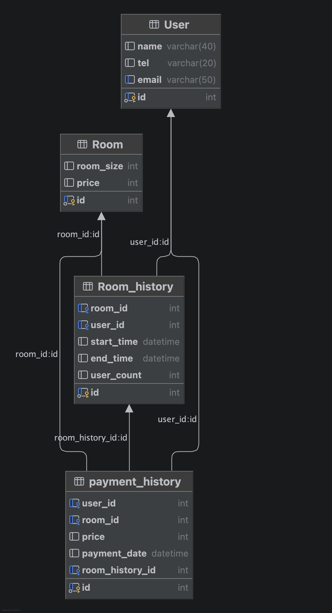

# JPA_SQL - JPQL 조인 / 서브쿼리 5문제 (스터디카페 예약)

미니 프로젝트 `ureca-studycafe-reservation` 의 스터디카페 예약 스키마를 참고해
연관관계 엔티티로 만든 **모의 조인, 서브쿼리 JPQL 5문제** 과제.

## 1. 엔티티 / 테이블 구조



| 테이블 | 엔티티 | 설명 | 주요 FK                                                               |
|--------|--------|------|---------------------------------------------------------------------|
| `User` | `User` | 회원 | -                                                                   |
| `Room` | `Room` | 회의실 | -                                                                   |
| `Room_history` | `RoomHistory` | 예약 | `room_id` → Room, `user_id` → User                                  |
| `payment_history` | `PaymentHistory` | 결제 | `user_id` → User, `room_id` → Room, `room_history_id` → RoomHistory |

- `RoomHistory` 가 `Room`/`User` 에 대한 `@ManyToOne` 소유 측.
- `PaymentHistory` 가 `User`/`Room`/`RoomHistory` 에 대한 `@ManyToOne` 소유 측.
- `Room.id` 는 스키마상 수동 PK(AUTO_INCREMENT 아님) → `@GeneratedValue` 없음.

## 2. 조회 문제 (#1 ~ #5)

> 하나씩 주석 해제하며 실행.

- **#1. 내부 조인 (3테이블, 명시적 inner join)**
  `RoomHistory` 와 `User`, `Room` 을 이용해서 모든 예약을
  **[예약자명, 회의실 id, 정원, 예약 시작시간]** 으로 조회한다.


- **#2. 조인 + where 필터**
  `PaymentHistory` 와 `User` 를 이용해서 결제금액(price)이 **50000 이상**인 결제를
  **[사용자명, 결제금액, 결제일]** 조건으로 조회한다.


- **#3. 외부 조인 (left outer join)**
  `Room` 을 기준으로 `RoomHistory` 를 left join 해서 **예약이 없는 회의실까지 포함**해
  **[회의실 id, 회의실 가격, 예약 시작시간]** 을 조회한다. (예약 없는 회의실은 시작시간 null)


- **#4. 서브쿼리 + where (비교)**
  `PaymentHistory` 를 이용해서 결제금액이 **전체 결제 평균금액보다 큰** 결제를
  **[결제 id, 금액]** 조건으로 조회한다. 평균은 `select avg(price)` 서브쿼리로 구한다.


- **#5. 상관 서브쿼리(select 절) + EXISTS**
  `User` 를 이용해서 **예약 이력이 있는(EXISTS)** 사용자만
  **[사용자명, 그 사용자의 총 결제금액]** 으로 조회한다.
  총 결제금액은 상관 서브쿼리 `select sum(price) ... where ph.user = u` 로 구한다.

## 3. 실행 방법

```bash
# 1) DB + 테이블 + 샘플 데이터 생성 (DB 생성 구문 포함)
mysql -u root -p < sql/schema.sql
mysql -u root -p < sql/data.sql

# 2) Test.java 의 #1부터 블록 실행 → 콘솔에서 결과 확인
#    이후 #2~#5 주석을 하나씩 해제하며 개별 실행
```

- DB 접속 정보는 `src/main/resources/META-INF/persistence.xml` (`my-pu`) 참고.
  기본값: `jdbc:mysql://localhost:3306/studycafedb`, root / 1234.
- `hibernate.show_sql=true` 라 JPQL 실제 SQL 변환 결과가 콘솔에 함께 출력된다.

## 4. 공유 산출물
1. 테이블 생성, 샘플데이터 SQL → `sql/schema.sql`, `sql/data.sql`
2. 엔티티 클래스 → `src/main/java/entity/` (User, Room, RoomHistory, PaymentHistory)
3. 테스트 → `src/main/java/Test.java` (문제 스켈레톤), `src/main/java/TestAnswer.java` (정답)
4. #1~#5 문제 → 본 README 2번 항목
